# 11. FormDesigner y SystemFormEntity - Sistema Dinámico de Entidades

Esta guía explica el sistema **FormDesigner** implementado que permite gestionar dinámicamente las entidades disponibles para diseño de formularios mediante la tabla `system_form_entities`.

## 🎯 Visión General

El FormDesigner es un sistema que:
- **Gestiona entidades dinámicamente** desde base de datos (no hardcodeado)
- **Organiza entidades por categorías** e iconos Material Design
- **Soporta entidades globales y específicas** por organización
- **Se integra automáticamente** con el entity-generator.py

## 📊 Estructura de SystemFormEntity

### Tabla: system_form_entities

```sql
CREATE TABLE system_form_entities (
    Id UNIQUEIDENTIFIER PRIMARY KEY DEFAULT NEWID(),
    OrganizationId UNIQUEIDENTIFIER NULL,           -- NULL = Global, GUID = Específica
    FechaCreacion DATETIME2 NOT NULL DEFAULT GETUTCDATE(),
    FechaModificacion DATETIME2 NOT NULL DEFAULT GETUTCDATE(),
    CreadorId UNIQUEIDENTIFIER NOT NULL,
    ModificadorId UNIQUEIDENTIFIER NOT NULL,
    Active BIT NOT NULL DEFAULT 1,

    -- Campos específicos de FormDesigner
    EntityName NVARCHAR(100) NOT NULL,              -- Nombre técnico (ej: "Empleado")
    DisplayName NVARCHAR(200) NOT NULL,             -- Nombre amigable (ej: "Empleados")
    Description NVARCHAR(500) NULL,                 -- Descripción de la entidad
    TableName NVARCHAR(100) NOT NULL,               -- Nombre de tabla (ej: "empleados")
    IconName NVARCHAR(50) NULL,                     -- Icono Material Design
    Category NVARCHAR(100) NULL,                    -- Categoría (ej: "RRHH", "Core")
    AllowCustomFields BIT NOT NULL DEFAULT 1,       -- Permite campos personalizados
    SortOrder INT NOT NULL DEFAULT 100              -- Orden de presentación
);
```

### Modelo C#: SystemFormEntity

```csharp
[Table("system_form_entities")]
public class SystemFormEntity : BaseEntity
{
    [Required]
    [MaxLength(100)]
    public string EntityName { get; set; } = "";

    [Required]
    [MaxLength(200)]
    public string DisplayName { get; set; } = "";

    [MaxLength(500)]
    public string? Description { get; set; }

    [Required]
    [MaxLength(100)]
    public string TableName { get; set; } = "";

    public bool AllowCustomFields { get; set; } = true;

    [MaxLength(50)]
    public string? IconName { get; set; }

    [MaxLength(100)]
    public string? Category { get; set; }

    public int SortOrder { get; set; } = 100;
}
```

## 🔧 FormDesignerController - Implementación

### Endpoints Disponibles

#### 1. GET /api/FormDesigner/entities
Obtiene entidades disponibles para FormDesigner.

```csharp
[HttpGet("entities")]
public async Task<IActionResult> GetAvailableEntities()
{
    try
    {
        var organizationId = GetCurrentOrganizationId();

        // Obtener entidades globales (OrganizationId=NULL) y específicas
        var entities = await _context.SystemFormEntities
            .Where(e => e.Active && (e.OrganizationId == null || e.OrganizationId == organizationId))
            .OrderBy(e => e.SortOrder)
            .Select(e => new FormEntityDto
            {
                Id = e.Id,
                EntityName = e.EntityName,
                DisplayName = e.DisplayName,
                Description = e.Description,
                IconName = e.IconName,
                Category = e.Category,
                AllowCustomFields = e.AllowCustomFields,
                IsActive = e.Active
            })
            .ToListAsync();

        return Ok(new { success = true, data = entities });
    }
    catch (Exception ex)
    {
        return BadRequest(new { success = false, message = ex.Message });
    }
}
```

#### 2. POST /api/FormDesigner/available-fields
Obtiene campos disponibles para una entidad específica.

#### 3. GET /api/FormDesigner/layout/{entityName}
Obtiene layout de formulario para una entidad.

#### 4. POST /api/FormDesigner/save-layout
Guarda configuración de layout de formulario.

## 🚀 Integración con Entity-Generator

### Parámetros del Entity-Generator

El entity-generator.py ahora soporta auto-registro en system_form_entities:

```bash
python3 tools/forms/entity-generator.py \
  --entity "NombreEntidad" \
  --module "Modulo.Core" \
  --target todo \
  --auto-register \              # Auto-registrar en system_form_entities
  --system-entity \              # Marcar como entidad global (OrganizationId=NULL)
  --icon "material_icon" \       # Icono Material Design
  --category "Categoria" \       # Categoría de organización
  --allow-custom-fields \        # Permitir campos personalizados
  --fields "nombre:string:100"
```

### Proceso de Auto-Registro

Cuando se usa `--target todo --auto-register`, el generador:

1. **Crea la entidad completa** (tabla + backend + frontend)
2. **Ejecuta SQL de registro** en system_form_entities:

```sql
INSERT INTO system_form_entities (
    Id, OrganizationId, FechaCreacion, FechaModificacion,
    CreadorId, ModificadorId, Active,
    EntityName, DisplayName, Description, TableName,
    IconName, Category, AllowCustomFields, SortOrder
) VALUES (
    NEWID(), NULL, GETUTCDATE(), GETUTCDATE(),
    '00000000-0000-0000-0000-000000000000', '00000000-0000-0000-0000-000000000000', 1,
    'NombreEntidad', 'NombresEntidades', 'Gestión de nombreentidades',
    'nombreentidades', 'material_icon', 'Categoria', 1, 999
);
```

3. **La entidad aparece automáticamente** en FormDesigner

## 📋 Estrategia de Organizaciones

### Entidades Globales del Sistema
- **OrganizationId = NULL**
- Disponibles para **todas las organizaciones**
- Ejemplos: Empleado, Empresa, Cliente, Proveedor
- Se crean con `--system-entity`

### Entidades Específicas por Organización
- **OrganizationId = GUID específico**
- Disponibles solo para **una organización**
- Ejemplos: entidades customizadas por empresa
- Se crean sin `--system-entity`

### Filtrado en FormDesigner

```csharp
// El FormDesigner filtra correctamente:
var entities = await _context.SystemFormEntities
    .Where(e => e.Active && (
        e.OrganizationId == null ||                    // Entidades globales
        e.OrganizationId == currentOrganizationId      // Entidades específicas
    ))
    .OrderBy(e => e.SortOrder)
    .ToListAsync();
```

## 🎨 Categorías e Iconos

### Categorías Estándar

| Categoría | Descripción | Ejemplos |
|-----------|-------------|----------|
| **Core** | Entidades centrales | Empresa, Sistema |
| **RRHH** | Recursos Humanos | Empleado, Cargo, Areas |
| **Localidades** | Geografía | Region, Comuna, Ciudad |
| **Bancario** | Financiero | Banco, TipoCuenta, FormaPago |
| **Previsional** | Previsión Social | AFP, Salud, Seguro |
| **Organizacional** | Estructura | CentroCosto, TipoContrato |

### Iconos Material Design Comunes

| Propósito | Icon | Uso |
|-----------|------|-----|
| **Personas** | `person`, `group` | Empleados, Usuarios |
| **Empresas** | `business`, `domain` | Empresas, Areas |
| **Ubicación** | `map`, `location_city`, `apartment` | Regiones, Comunas |
| **Finanzas** | `account_balance`, `payment`, `savings` | Bancos, Pagos |
| **Trabajo** | `work`, `assignment`, `schedule` | Cargos, Contratos |
| **Seguridad** | `security`, `shield`, `health_and_safety` | Seguros, Salud |

## 🛠️ Ejemplos de Uso

### 1. Crear Entidad Global del Sistema

```bash
# Entidad global para todas las organizaciones
python3 tools/forms/entity-generator.py \
  --entity "TipoDocumento" --plural "TiposDocumento" \
  --module "Core.General" --target todo \
  --auto-register --system-entity \
  --icon "description" --category "Core" \
  --fields "nombre:string:100" "codigo:string:50"
```

**Resultado:**
- ✅ Tabla `tipos_documento` creada
- ✅ Backend + Frontend generados
- ✅ Registrada en `system_form_entities` con `OrganizationId=NULL`
- ✅ Disponible en FormDesigner para todas las organizaciones

### 2. Crear Entidad Específica de Organización

```bash
# Entidad específica para una organización
python3 tools/forms/entity-generator.py \
  --entity "ProductoCustom" --plural "ProductosCustom" \
  --module "Custom.Inventario" --target todo \
  --auto-register \
  --icon "inventory" --category "Custom" \
  --fields "nombre:string:100" "precio:decimal:10,2"
```

**Resultado:**
- ✅ Tabla `productos_custom` creada
- ✅ Backend + Frontend generados
- ✅ Registrada en `system_form_entities` con `OrganizationId=NULL` (por ahora)
- ✅ Disponible en FormDesigner

### 3. Consultar Entidades desde FormDesigner

```javascript
// Frontend - Obtener entidades disponibles
const response = await fetch('/api/FormDesigner/entities');
const data = await response.json();

console.log(data.data); // Array de entidades con iconos y categorías
```

## 📈 Beneficios del Sistema

### ✅ Ventajas
1. **Dinámico**: No más hardcoding de entidades
2. **Organizado**: Categorías e iconos consistentes
3. **Automático**: Auto-registro desde entity-generator
4. **Escalable**: Soporte multi-organización
5. **Mantenible**: Un solo lugar para gestionar entidades

### 🔄 Flujo Completo

```mermaid
graph TD
    A[entity-generator.py] --> B[Crear Entidad Completa]
    B --> C[Auto-registro en system_form_entities]
    C --> D[FormDesigner consulta BD]
    D --> E[Entidades disponibles dinámicamente]
    E --> F[Usuario diseña formularios]
```



## 🚀 Migración de Datos Existentes

### Seeding de Entidades Base

Las entidades del sistema base ya están insertadas:

```sql
-- Entidades base del sistema (ya ejecutado)
INSERT INTO system_form_entities VALUES
    ('Empleado', 'Empleados', 'Gestión de empleados', 'empleados', 'person', 'RRHH', 1, 10),
    ('Empresa', 'Empresas', 'Gestión de empresas', 'empresas', 'business', 'Core', 1, 20),
    ('Cliente', 'Clientes', 'Gestión de clientes', 'clientes', 'person_outline', 'Ventas', 1, 30),
    ('Proveedor', 'Proveedores', 'Gestión de proveedores', 'proveedores', 'local_shipping', 'Compras', 1, 40);
```

## 🎯 Próximos Pasos

1. **Implementar resolución real de OrganizationId** desde JWT/Claims
2. **Crear interfaz de administración** para gestionar system_form_entities
3. **Agregar validaciones** para evitar duplicados
4. **Implementar soft-delete** para entidades
5. **Crear sistema de versionado** para layouts de formularios

Este sistema proporciona la base sólida para un FormDesigner completamente dinámico y escalable.